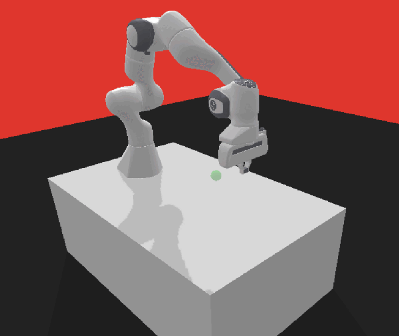

# Planificación de trayectorias de un brazo robótico mediante aprendizaje por refuerzo

Este código permite entrenar un brazo robótico en la planificación de trayectorias mediante algoritmos de aprendizaje por refuerzo. Por defecto, utiliza los algoritmos **PPO** y **SAC** de la librería Stable Baselines3, pero el código se puede adaptar para utilizar cualquier otro algoritmo de esta librería.



El robot que se utiliza es **[Franka Emika Panda](https://www.franka.de/)** y se simula con el motor de física **PyBullet**; los entornos están integrados con **OpenAI Gym**.

El proyecto cuenta con dos módulos: train y run. [train.py](../master/src/train.py) se utiliza para entrenar al robot y permite ir guardando los modelos aprendidos durante el entrenamiento. Tras finalizar el entrenamiento, los modelos se pueden cargar en [run.py](../master/src/run.py) para ver cómo se desempeñan. Permite renderizar el entorno para ver el movimiento del robot en vivo, guardar el vídeo como un gif y guardar un log con la información de cada movimiento.

Los modelos y logs generados en train.py se guardan en la carpeta train. Los vídeos y logs generados en run.py se guardan en la carpeta test.


### Instalación

Se deben crear dos entornos virtuales de Python 3.9: uno para el train ([requirements_train.txt](../master/requirements_train.txt)) y otro para el run ([requirements_run.txt](../master/requirements_run.txt)).

Se debe establecer para ambos entornos el directorio de trabajo en la carpeta raíz del proyecto, que será ".../reinforcement-learning-brazo-robot"

Para comprobar la correcta instalación, se debe ejecutar el script [run.py](../master/src/run.py) en su entorno virtual y, sin cambiar ningún parámetro del código, tiene que funcionar; es decir, se verá el brazo robótico moviéndose.


### Uso

**[train.py](../master/src/train.py)**

**1. Initial data.** En primer lugar, se debe definir la información inicial en el siguiente fragmento de código:

```python
if __name__ == '__main__':
    # INITIAL DATA
    policy = 'MlpPolicy'  # Define el modelo (red neuronal)
    entorno = 'PandaReach-v2'  # Define el robot, la tarea y el tipo de reward
    algoritmo = 'PPO'  # 'PPO', 'SAC', 'both'
    PRECISION = 0.05  # precisión al goal, por defecto 0.05 m
    GOAL_RANGE = 0.3  # define el volumen en el que aparece el goal, por defecto 0.3 --> 0.3x0.3x0.3 m3
    SEEDS = [17, 27]
```

**2. Timesteps.** En segundo lugar, se establece el número total de timesteps para el entrenamiento y cada cuánto se guardará el modelo:

```python
def learnPPO(policy, env, models_dir, logs_dir):
    # ...
    TIMESTEPS = 100_000  # cada cuánto se guarda el modelo
    TOTAL_TIMESTEPS = 5_000_000  # múltiplo de TIMESTEPS

def learnSAC(policy, env, models_dir, logs_dir):
    # ...
    TIMESTEPS = 20_000  # cada cuánto se guarda el modelo
    TOTAL_TIMESTEPS = 200_000  # múltiplo de TIMESTEPS
```

**3. Red neuronal.** (OPCIONAL) En tercer lugar, se puede personalizar la red neuronal. Por ejemplo, para SAC:

```python
def learnSAC(policy, env, models_dir, logs_dir):
    # ...
    policy_kwargs = dict(activation_fn=th.nn.ReLU,
                         net_arch=dict(pi=[256, 256, 256], qf=[256, 256, 256]))
```

**4. Hiperparámetros.** (OPCIONAL) Por último, se especifican los hiperparámetros para cada algoritmo. Por ejemplo, para PPO:

```python
    model = PPO(policy, env, verbose=1, tensorboard_log=logs_dir,
                learning_rate=0.000104019,
                n_steps=512,
                batch_size=32,
                n_epochs=5,
                gamma=0.9,
                gae_lambda=1,
                clip_range=0.3,
                ent_coef=0.0000000752585,
                vf_coef=1,
                max_grad_norm=0.9)
```

**5. Tensorboard.** (OPCIONAL) Se puede hacer un seguimiento del entrenamiento mediante tensorboard. Abrimos una terminal dentro del entorno virtual (por ejemplo, en PyCharm) y nos colocamos en la carpeta del proyecto. Una vez ahí, ejecutamos el siguiente comando:

```
tensorboard --logdir .\train\_logs
```

**[run.py](../master/src/run.py)**

**1. Initial data.** En primer lugar, se debe definir la información inicial en el siguiente fragmento de código:

```python
if __name__ == '__main__':
    # INITIAL DATA
    entorno = 'PandaReach-v3'  # Define el robot, la tarea y el tipo de reward
    algoritmo = 'PPO_1'  # Subcarpeta en la que está el modelo
    modelo = 'modelo1.zip'
    PRECISION = 0.05  # precisión al goal, por defecto 0.05 m
    GOAL_RANGE = 0.3  # define el volumen en el que aparece el goal, por defecto 0.3 --> 0.3x0.3x0.3 m3
```

**2. Render data.** (OPCIONAL) En segundo lugar, se debe indicar la información relativa al renderizado:

```python
    # RENDER DATA
    GIF = True  # si queremos guardar un .gif del render (True) o no (False)
    render = 'rgb_array'
    renderer = 'OpenGL'
    render_width = 720
    render_height = 480
    render_target_position = [0., 0., 0.]
    render_distance = 1.0
    render_yaw = 45
    render_pitch = -30
    render_roll = 0
```

**3. Episodios.** (OPCIONAL) En tercer lugar, se debe establecer el número de episodios a simular:

```python
def runModel(model, vec_env, GIF):
    # Run the model

    episodes = 15
```


### Estructura del directorio del proyecto: 

```      
├── src                      <- Código fuente a utilizar en este proyecto
├── train                    <- Aquí se guardan los resultados del entrenamiento
├── tests                    <- Aquí se guardan los resultados del test
├── .gitignore               <- ignore files, including virtual environment  
├── README.md
├── requirements_train.txt   <- El archivo de requisitos para reproducir el entorno de entrenamiento
├── requirements_run.txt     <- El archivo de requisitos para reproducir el entorno de test/run

```
